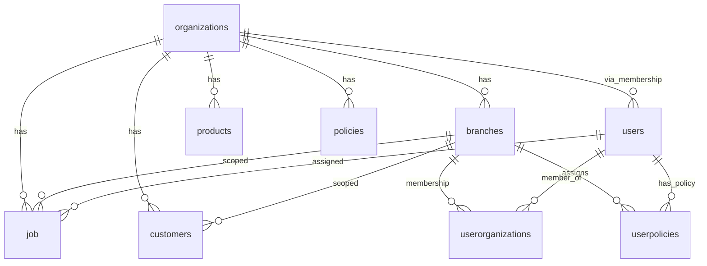
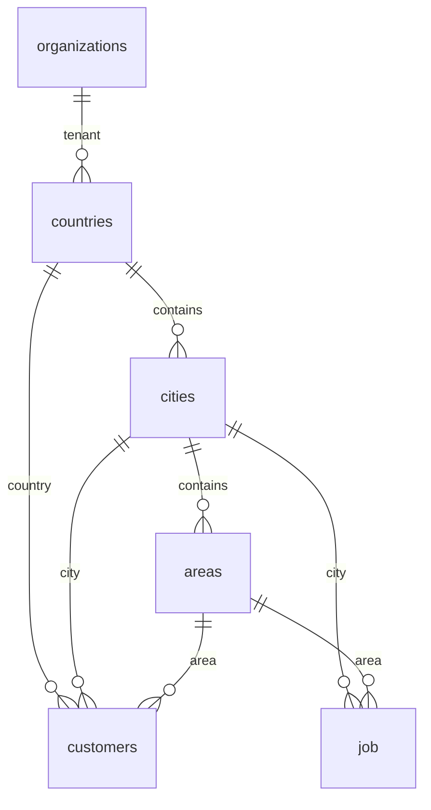
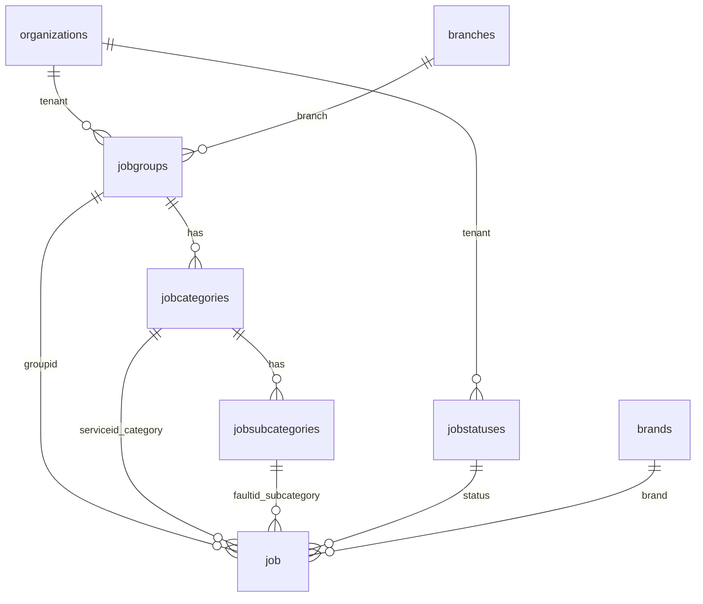
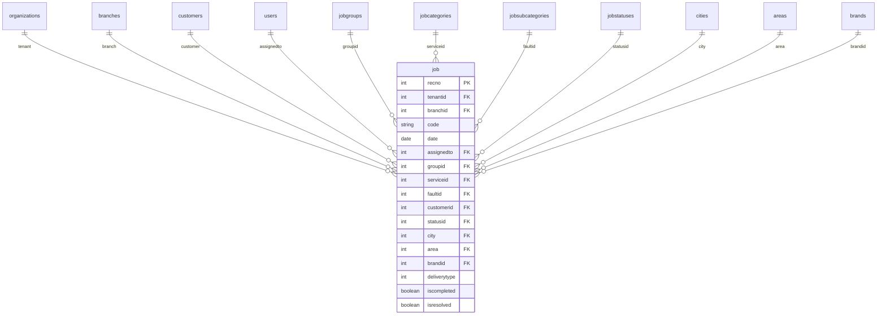
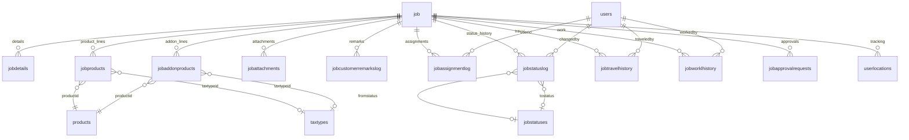
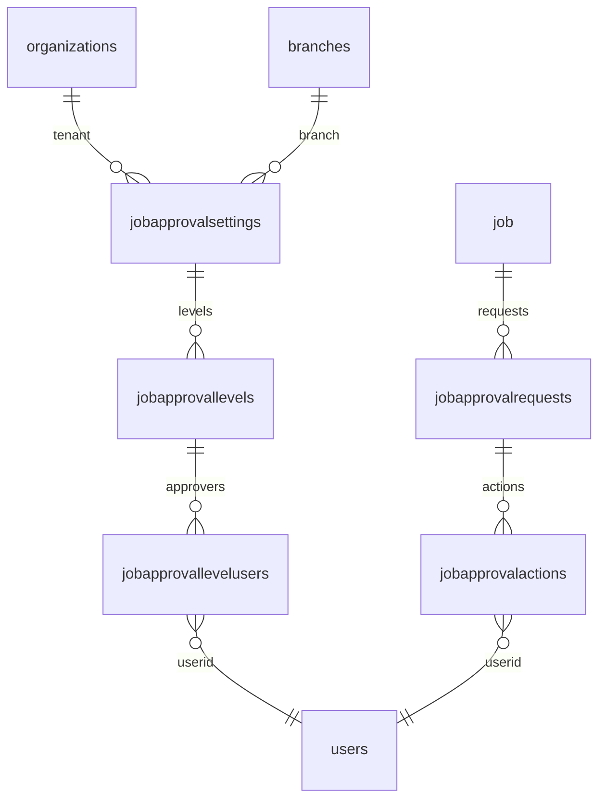
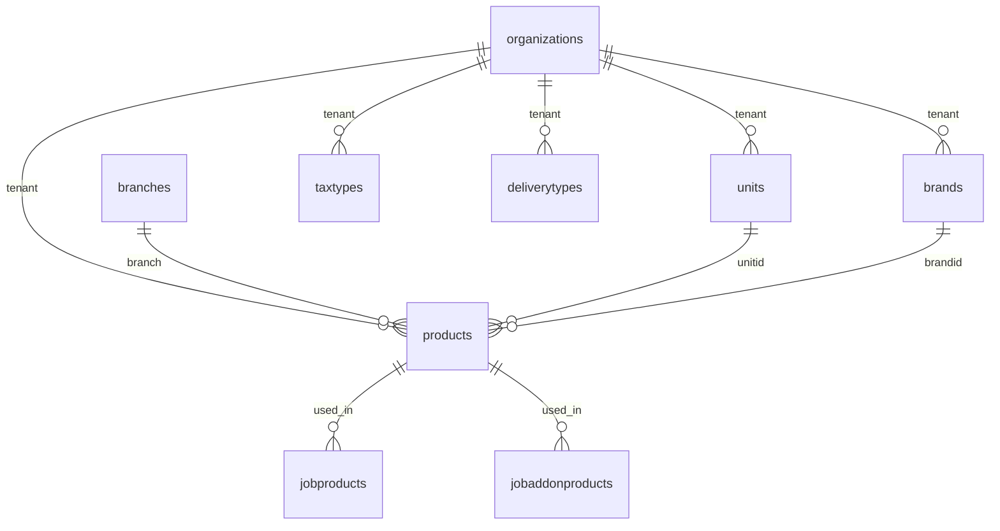
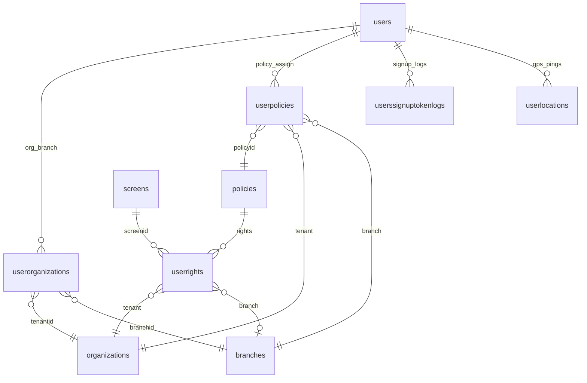

# ConnectCMS PostgreSQL — ER Diagram

Source: `prisma/schema.prisma` (PostgreSQL)

**Interactive HTML (full browser width):**

| Diagram | File |
|--------|------|
| With column attributes | [`database-er-diagram.html`](database-er-diagram.html) |
| Tables & relations only | [`database-er-diagram-overview.html`](database-er-diagram-overview.html) |

Regenerate: `node scripts/generate-er-html.js`

## Overview (tenant hub)

## Geography

## Job taxonomy (group → category → subcategory)

**`job` hierarchy columns**

| API field   | DB column  | References              |
|------------|------------|-------------------------|
| serviceId  | groupid    | jobgroups.groupid       |
| categoryId | serviceid  | jobcategories.categoryid |
| faultId    | faultid    | jobsubcategories.subcategoryid |

## Core `job` entity

## Job child tables (1:N from `job`)

## Job approval workflow

## Products & catalog

## Users, policies & screen rights

## Entity list (40 tables)

| Domain | Tables |
|--------|--------|
| Tenancy | organizations, branches |
| Geo | countries, cities, areas |
| Customers | customers |
| Job taxonomy | jobgroups, jobcategories, jobsubcategories, jobstatuses |
| Jobs | job, jobdetails, jobproducts, jobaddonproducts, jobattachments, jobcustomerremarkslog, jobassignmentlog, jobstatuslog, jobtravelhistory, jobworklhistory |
| Approval | jobapprovalsettings, jobapprovallevels, jobapprovallevelusers, jobapprovalrequests, jobapprovalactions |
| Catalog | products, units, brands, taxtypes, deliverytypes |
| Auth/RBAC | users, userorganizations, userpolicies, policies, screens, userrights, userssignuptokenlogs |
| Tracking | userlocations |
